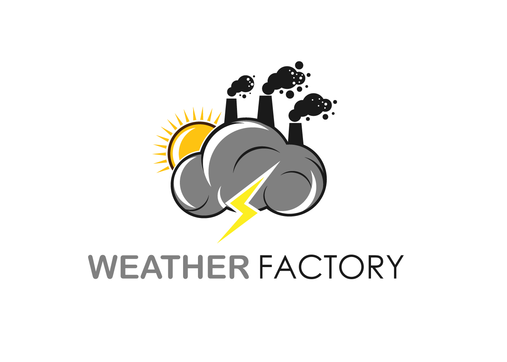

<div align="center">

  
  <h1>Weather Factory</h1>
  
  <p>
    An awesome weather checking app for daily use! 
  </p>
  
  
<!-- Badges -->
<p>
  <a href="https://github.com/deepakyadav0223/animated-umbrella/graphs/contributors">
    
  </a>
  <a href="">
    
  </a>
  <a href="https://github.com/deepakyadav0223/animated-umbrella/network/members">
    
  </a>
  <a href="https://github.com/deepakyadav0223/animated-umbrella/stargazers">
    
  </a>
  <a href="https://github.com/deepakyadav0223/animated-umbrella/issues/">
    
  </a>
  
</p>
   
<h4>
    <a href="https://github.com/deepakyadav0223/animated-umbrella">Documentation</a>
  <span> · </span>
    <a href="https://github.com/deepakyadav0223/animated-umbrella/issues/">Report Bug</a>
  <span> · </span>
    <a href="https://github.com/deepakyadav0223/animated-umbrella/issues/">Request Feature</a>
  </h4>
</div>

<br />

<!-- Table of Contents -->
# :notebook_with_decorative_cover: Table of Contents

- [About the Project](#star2-about-the-project)
  * [Screenshots](#camera-screenshots)
  * [Tech Stack](#space_invader-tech-stack)
  * [Features](#dart-features)
  * [Environment Variables](#key-environment-variables)
- [Getting Started](#toolbox-getting-started)
  * [Prerequisites](#bangbang-prerequisites)
  * [Installation](#gear-installation)
  * [Running Tests](#test_tube-running-tests)
  * [Run Locally](#running-run-locally)
  * [Deployment](#triangular_flag_on_post-deployment)
- [Usage](#eyes-usage)
- [Roadmap](#compass-roadmap)
- [Contributing](#wave-contributing)
  * [Code of Conduct](#scroll-code-of-conduct)
- [License](#warning-license)
- [Contact](#handshake-contact)
- [Acknowledgements](#gem-acknowledgements)

  

<!-- About the Project -->
## :star2: About the Project


<!-- Screenshots -->
### :camera: Screenshots

<div align="center"> 
  
</div>


<!-- TechStack -->
### :space_invader: Tech Stack

<details>
  <summary>Languge</summary>
  <ul>
    <li><a href="https://www.python.org/">Python</a></li>
  </ul>
</details>

<details>
  <summary>FrameWork/Modules</summary>
  <ul>
    <li><a href="https://pypi.org/project/tk-tools/">Tkinter</a></li>
    <li><a href="https://pypi.org/project/requests/">Requests</a></li>
  </ul>
</details>


<!-- Features -->
### :dart: Features

- Gives the Temperature Information of user entered city.
- Gives information regarding AQI(Air Quality Index).
- Compact & light.


<!-- Env Variables -->
### :key: Environment Variables

To run this project, you will need to add the following environment variables to your main file

`api_key`


<!-- Getting Started -->
## 	:toolbox: Getting Started

<!-- Prerequisites -->
### :bangbang: Prerequisites

This project uses pip as package manager

```bash
 Install the latest version of python & pip automatically insatlled along that
```

<!-- Installation -->
### :gear: Installation

Install my-project with npm

```bash
  pip install requests, json, tk-tools
 
```
   


<!-- Run Locally -->
### :running: Run Locally

Clone the project

```bash
  git clone https://github.com/deepakyadav0223/animated-umbrella.git
```

Go to the project directory

```bash
  cd animated-umbrella
```


Start the script

```bash
  python My_Weather_Finding_Application.py
```


<!-- Usage -->
## :eyes: Usage

This Project takes the data from the user as a city field and then using an open api(open weather), it fetches the data and populate the resultant fields.


```python
    api_key = "paste your api key"
    base_url =  "http://api.openweathermap.org/data/2.5/weather?"
    city_name = city_field.get()
    complete_url = base_url + "appid=" + api_key +"&q=" + city_name
    response =  requests.get(complete_url)
    x = response.json()
```

<!-- Roadmap -->
## :compass: Roadmap

* [x] Install python latest version and add its PATH 
* [x] Take this project locally on your machine
* [ ] Go to open weather map site and take their free api
* [ ] put that api at the required line
* [ ] Install the dependencies and run the project


<!-- Contributing -->
## :wave: Contributing

<a href="https://github.com/Louis3797/awesome-readme-template/graphs/contributors">
  
</a>


Contributions are always welcome!

See `contributing.md` for ways to get started.


<!-- Code of Conduct -->
### :scroll: Code of Conduct

Please read the [Code of Conduct](https://github.com/deepakyadav0223/animated-umbrella/CODE_OF_CONDUCT.md)


<!-- License -->
## :warning: License

Distributed under the MIT License. See LICENSE.txt for more information.


<!-- Contact -->
## :handshake: Contact

Your Name - [@twitter_handle](https://twitter.com/twitter_handle) - deepak04216

Project Link: [https://github.com/deepakyadav0223/animated-umbrella](https://github.com/deepakyadav0223/animated-umbrella)


<!-- Acknowledgments -->
## :gem: Acknowledgements
  - [openweathermap](https://openweathermap.org/)
